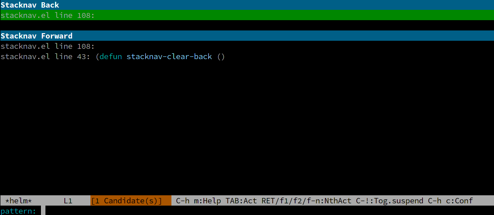

## `stacknav.el`: stack-based navigation

This is a little hack for stack-based navigation in Emacs. You can mark the
current spot, and later go "back"; a stack of locations is saved. You can go
"forward" too. (So many features!)

```
   M-s M-m      mark current location
   M-s M-b      go back
   M-s M-f      go forward

   M-s c b      clear back list (move to cleared-locs-list)
   M-s c f      clear forward list (move to cleared-locs-list)
   M-s c c      clear cleared-locs-list ("empty the trash")

   M-s M-s      invoke Helm menu with all locs
```

The Helm menu looks something like:



This was initially a one-night hack; I'll probably improve it someday; PRs
welcome, but no guarantees!
